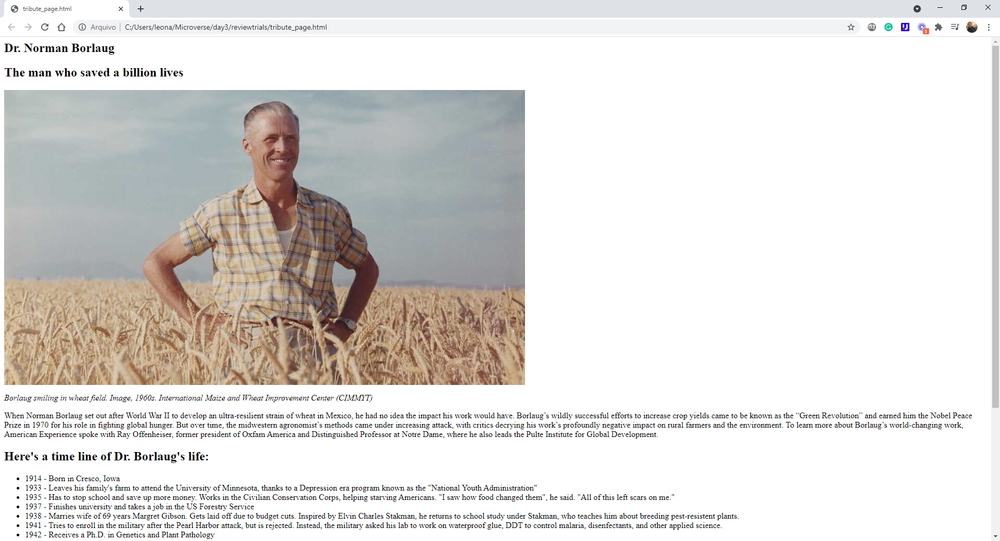

# Project Name

> Project Microverse Trials Code Review

This exercise was made to us make some improvements to your trial code, use the linter tool to check the source, and for us training how to be a code reviewer.

## Built With

- Major languages: HTML
- Frameworks: Visual Studio
- Technologies used: Visual Studio, HTML, Linter Code check, bash.

## Live Demo

[Live Demo Link](https://livedemo.com)

## Getting Started

In the previous lessons, you got an introduction to the code review process and you upgraded your HTML and CSS skills. That means that you are ready to perform a code review on your code!

IMPORTANT NOTE: Read all requirements before you start building your project..

### Project Requirements 

- Create a new empty repo.
- Copy your code from the project that you completed during the Admissions Trial: - If you do not have the code from the Admissions Trial ask someone from your Standup Team to share their code with you. In that case, remember to add an attribution note and acknowledgment in your README file.
- Create a new branch for your copied code.
- Open a pull request.
- Play the role of the Code Reviewer:
    - Follow the list from the article "How to give a code review?".
    - Check if you have used semantic HTML tags.
    - Check if you applied HTML & CSS best practices.
- Add as many comments as possible in the given time and finish your review. Remember to add a minimum of 2 comments - you will definitely find something that could have been done better!
- Copy a link to the pull request and ask for a code review in your Student Dashboard as usual. (The only difference will be that the Code Reviewer won't check your code but the review you performed - isn't it a code review inception? ;))

### Setup

- Don't forget to create a workflow repo and install the linter

### Install

- Follow the instruction as before.

### Run tests

- Commit all and copile linter

## Authors

👤 **Author1**

- GitHub: [@Leonardoeng13](https://github.com/leonardoeng13)
- Twitter: [@Leo de Andrade](https://twitter.com/andrade_leo)
- LinkedIn: [Leonardo de Andrade](https://linkedin.com/in/leonardodeandrade)

## 🤝 Contributing

Contributions, issues, and feature requests are welcome!

Feel free to check the [issues page](../../issues/).

## Show your support

Give a ⭐️ if you like this project!

## Acknowledgments

- Hat tip to anyone whose code was used
- Inspiration
- etc

## 📝 License

This project is [MIT](./MIT.md) licensed.
